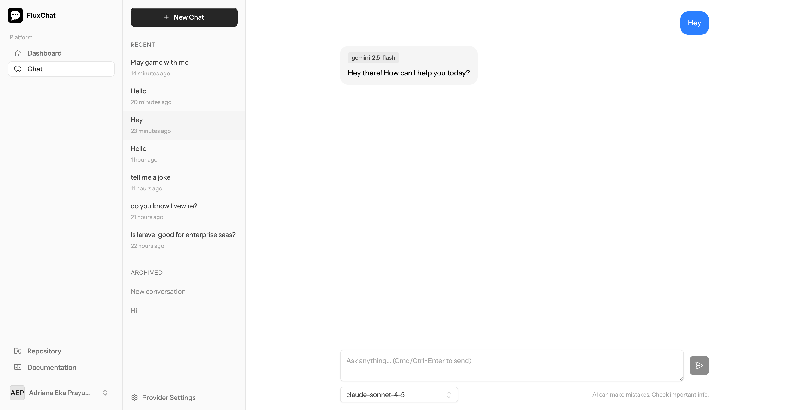

# FluxChat

> **⚠️ WORK IN PROGRESS**
>
> This project is under active development and is not yet ready for production use. Features may be incomplete, APIs may change, and breaking changes can occur at any time. Use at your own risk!


FluxChat is a modern, multi-provider AI chat application built with Laravel 12, Livewire 4, and Volt. It provides a beautiful, responsive interface for conversing with various LLM providers including OpenAI, Anthropic, Google Gemini, Ollama, and custom OpenAI-compatible APIs.



## Current Status

This project is approximately **70% complete**. Core functionality is working, but several features are still being developed and polished.

### What's Working ✅

- [x] Multi-provider support (OpenAI, Anthropic, Gemini, Ollama, Cliproxy)
- [x] Real-time SSE streaming responses
- [x] Basic conversation management (create, view, delete)
- [x] Model switching mid-conversation
- [x] Dark mode via Flux UI
- [x] Token usage tracking
- [x] Encrypted API key storage

### In Progress 🚧

- [ ] Conversation search and filtering
- [ ] Export conversations (Markdown, JSON)
- [ ] System prompt templates/presets
- [ ] Conversation branching/forking
- [ ] Mobile-optimized sidebar
- [ ] Keyboard navigation improvements

### Planned Features 📋

- [ ] User authentication & multi-user support
- [ ] Conversation sharing via public links
- [ ] Image/file attachments (vision models)
- [ ] Voice input/output
- [ ] Plugin system for custom integrations
- [ ] Usage analytics dashboard
- [ ] Rate limiting & cost tracking

## Features

- **Multi-Provider Support** - Connect to OpenAI, Anthropic, Google Gemini, Ollama, and custom APIs
- **Real-time Streaming** - SSE-based streaming responses with live token display
- **Model Switching** - Change models mid-conversation with per-message model tracking
- **Conversation Management** - Create, archive, delete, and organize conversations
- **Dark Mode** - Full dark mode support via Flux UI
- **Responsive Design** - Works seamlessly on desktop and mobile
- **Token Usage Tracking** - View input/output token counts per response
- **Secure API Key Storage** - Encrypted storage for all provider credentials

## Tech Stack

- **Backend**: Laravel 12, PHP 8.2+
- **Frontend**: Livewire 4, Volt, Alpine.js, Tailwind CSS
- **UI Components**: Flux UI Pro
- **LLM Integration**: Laravel Prism
- **Database**: SQLite (default), MySQL/PostgreSQL supported
- **Testing**: Pest PHP

## Project Structure

```
app/
├── Http/Controllers/Chat/     # Streaming controller
├── Models/                    # Eloquent models (Conversation, Message, Provider, etc.)
├── Services/
│   ├── ConversationService.php
│   └── LLM/                   # Provider implementations
│       ├── LLMService.php
│       ├── Providers/         # Anthropic, OpenAI, Gemini, Ollama, Cliproxy
│       └── ...
resources/views/
├── pages/kitchen/             # Folio pages
│   ├── chat.blade.php         # Main chat interface
│   └── settings/
│       └── providers.blade.php # Provider configuration
├── components/                # Blade components
└── ...
tests/
├── Feature/                   # Feature tests
└── Unit/                      # Unit tests
```

## Getting Started

### Prerequisites

- **PHP 8.2+** with extensions: `curl`, `json`, `mbstring`, `openssl`, `pdo`, `tokenizer`, `xml`
- **Composer 2.x**
- **Node.js 18+** and npm
- **SQLite** (included) or MySQL/PostgreSQL

### Installation

1. **Clone the repository:**
   ```bash
   git clone https://github.com/yourusername/fluxchat.git
   cd fluxchat
   ```

2. **Install PHP dependencies:**
   ```bash
   composer install
   ```

3. **Install Node dependencies:**
   ```bash
   npm install
   ```

4. **Environment setup:**
   ```bash
   cp .env.example .env
   php artisan key:generate
   ```

5. **Create database and run migrations:**
   ```bash
   touch database/database.sqlite
   php artisan migrate
   ```

6. **Build frontend assets:**
   ```bash
   npm run build
   ```

### Running the Application

#### Option 1: Simple Development Server

```bash
php artisan serve
```
Then visit `http://localhost:8000`

#### Option 2: Full Development Environment (Recommended)

This runs the server, queue worker, log viewer, and Vite dev server concurrently:

```bash
composer dev
```

This starts:
- **Laravel server** at `http://localhost:8000`
- **Queue worker** for background jobs
- **Pail** for real-time log viewing
- **Vite** for hot module replacement

#### Option 3: Production with Octane

For high-performance production deployments:

```bash
php artisan octane:start --server=frankenphp --host=0.0.0.0 --port=8000
```

### Running with Laravel Herd (macOS)

If you use [Laravel Herd](https://herd.laravel.com/):

1. Link the project:
   ```bash
   cd /path/to/fluxchat
   herd link
   ```

2. Access at `http://fluxchat.test`

3. Enable HTTPS (optional):
   ```bash
   herd secure
   ```

## Configuration

### Adding AI Providers

1. Start the application and navigate to **Settings > Providers**
2. Click **Add Provider** and select your provider type
3. Enter your API key and configure options
4. Click **Test Connection** to verify
5. Save and start chatting!

#### Provider-Specific Setup

**OpenAI:**
- Get your API key from [platform.openai.com](https://platform.openai.com/api-keys)
- Models: GPT-4o, GPT-4 Turbo, GPT-3.5 Turbo, etc.

**Anthropic:**
- Get your API key from [console.anthropic.com](https://console.anthropic.com/)
- Models: Claude 3.5 Sonnet, Claude 3 Opus, Claude 3 Haiku, etc.

**Google Gemini:**
- Get your API key from [aistudio.google.com](https://aistudio.google.com/apikey)
- Models: Gemini 1.5 Pro, Gemini 1.5 Flash, Gemini 1.0 Pro

**Ollama (Local):**
- Install Ollama from [ollama.ai](https://ollama.ai/)
- Run models locally: `ollama run llama3.2`
- No API key required, just set the base URL (default: `http://localhost:11434`)

**Custom API (Cliproxy):**
- For OpenAI-compatible APIs
- Configure base URL and authentication headers
- Manually add available models

### Environment Variables

Key environment variables for `.env`:

```env
# Application
APP_NAME=FluxChat
APP_URL=http://localhost:8000

# Database (SQLite is default)
DB_CONNECTION=sqlite

# For MySQL/PostgreSQL:
# DB_CONNECTION=mysql
# DB_HOST=127.0.0.1
# DB_PORT=3306
# DB_DATABASE=fluxchat
# DB_USERNAME=root
# DB_PASSWORD=

# Queue (for background jobs)
QUEUE_CONNECTION=database

# Session
SESSION_DRIVER=database
```

## Usage Guide

### Starting a Conversation

1. Click **New Chat** in the sidebar
2. Select a model from the dropdown (bottom of chat)
3. Type your message and press **Enter** or click send
4. Watch the response stream in real-time!

### Keyboard Shortcuts

| Shortcut | Action |
|----------|--------|
| `Cmd/Ctrl + Enter` | Send message |
| `Shift + Enter` | New line in message |

### Managing Conversations

- **Archive**: Hover over a conversation and click the archive icon
- **Delete**: Hover and click the trash icon
- **Switch**: Click any conversation to load it

### Switching Models

You can change the AI model at any time using the dropdown below the message input. Each message records which model generated it.

## Development

### Running Tests

```bash
# Run all tests
php artisan test

# Run with Pest directly
./vendor/bin/pest

# Run specific test file
./vendor/bin/pest tests/Feature/Services/LLMServiceTest.php

# Run with coverage
./vendor/bin/pest --coverage
```

### Code Style

This project uses Laravel Pint for code formatting:

```bash
# Check formatting
./vendor/bin/pint --test

# Fix formatting (dirty files only)
./vendor/bin/pint --dirty

# Fix all files
./vendor/bin/pint
```

### Adding a New Provider

1. Create a new provider class in `app/Services/LLM/Providers/`:
   ```php
   class MyProvider implements ProviderInterface
   {
       public function testConnection(): bool { ... }
       public function syncModels(): array { ... }
       public function getDefaultModels(): array { ... }
   }
   ```

2. Register in `LLMService::getProviderService()`

3. Add UI configuration in `providers.blade.php`

### Database Migrations

```bash
# Run migrations
php artisan migrate

# Rollback last migration
php artisan migrate:rollback

# Fresh migration (drops all tables)
php artisan migrate:fresh

# With seeders
php artisan migrate:fresh --seed
```

## Troubleshooting

### Common Issues

**"No models available"**
- Ensure you've added and configured at least one provider
- Check that the provider connection test passes
- For Ollama, ensure the server is running

**Streaming not working**
- Verify your provider supports streaming
- Check browser console for JavaScript errors
- Ensure the `/chat/stream` route is accessible

**API Key errors**
- Double-check your API key is correct
- Ensure the key has appropriate permissions
- Check provider-specific rate limits

### Logs

View application logs:

```bash
# Real-time log viewing
php artisan pail

# Or check the log file directly
tail -f storage/logs/laravel.log
```

### Cache Issues

Clear all caches:

```bash
php artisan optimize:clear
```

## License

This project is open-source and available under the MIT License.

## Credits

- [Laravel](https://laravel.com/) - The PHP framework
- [Livewire](https://livewire.laravel.com/) - Full-stack framework for Laravel
- [Flux UI](https://fluxui.dev/) - Beautiful UI components
- [Laravel Prism](https://github.com/prism-php/prism) - Multi-provider LLM integration
- [Tailwind CSS](https://tailwindcss.com/) - Utility-first CSS framework
- [Alpine.js](https://alpinejs.dev/) - Lightweight JavaScript framework
